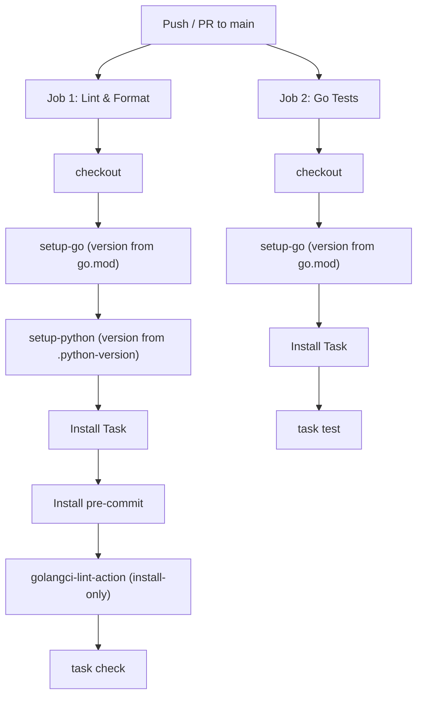

# Design Doc: CI Automation & Version Management

## Context

As this repository grows into a polyglot monorepo hosting tools in multiple
languages, CI becomes the primary mechanism for enforcing code quality at scale.
A CI pipeline that silently drifts from the local developer environment —
through hardcoded versions, manual dependency bumps, or subtle configuration
mismatches — is a liability rather than a safety net.

This document describes the principles and concrete mechanisms that govern CI
automation in this repository, with three overarching concerns:

- **Parity**: CI must execute the exact same commands a developer runs locally.
  If `task check` passes on a developer's machine, it must pass in CI — and vice
  versa. Any divergence erodes trust in the pipeline.
- **Single source of truth**: Tool versions (Go, Python, linters) should be
  defined in exactly one place and consumed everywhere else. Duplicating a
  version string across `go.mod`, `ci.yml`, and local scripts is a guaranteed
  source of drift.
- **Self-maintaining infrastructure**: Dependency versions across the CI
  pipeline — GitHub Actions, Go modules, pre-commit hooks — should be kept
  current through automation, not manual intervention. The pipeline should
  surface staleness as PRs, not as surprise breakages.

## Goals

- **Fix CI**: Eliminate all failures in both the Lint and Go Tests jobs.
- **Mirror local workflow**: CI should run the exact same commands a developer
  runs locally (`task check`, `task test`), reducing "works on my machine"
  discrepancies.
- **Single source of truth for versions**: Each tool version should be defined
  in exactly one place, with CI reading from that source — never duplicating it.
- **Automated maintenance**: Dependency versions (actions, Go modules) should be
  kept current via automated PRs, not manual intervention.

## Design

### 1. Taskfile Includes (fixing the recursion)

**Problem**: The root `Taskfile.yml` defined delegating tasks like:

```yaml
go:test:
  dir: go
  cmds:
    - task: test # ← This resolves to ROOT's "test", not go/Taskfile.yml's
```

This created a cycle: `test` → `go:test` → `test` → `go:test` → ∞

**Solution**: Replace the manual delegation pattern with Task's native
`includes` directive:

```yaml
includes:
  go:
    taskfile: go/Taskfile.yml
    dir: go
```

This properly namespaces the child Taskfile. Now `go:test` resolves to
`go/Taskfile.yml`'s `test` task, not the root's.

**Files**: [Taskfile.yml](../Taskfile.yml),
[go/Taskfile.yml](../go/Taskfile.yml)

### 2. golangci-lint Installation in CI

**Problem**: The pre-commit hook uses `language: system`, meaning pre-commit
does not install the binary — it expects it on `$PATH`. CI runners don't have
it.

**Solution**: Use the official `golangci/golangci-lint-action` with
`install-only: true` to place the binary on `$PATH` without running it.
Pre-commit then invokes it normally via the hook.

```yaml
- name: Install golangci-lint
  uses: golangci/golangci-lint-action@v9
  with:
    install-only: true
```

**Justification**: The
[official golangci-lint CI docs](https://golangci-lint.run/docs/welcome/install/ci/#github-actions)
recommend this action for GitHub-based projects. The `install-only` option is
[documented in the action's README](https://github.com/golangci/golangci-lint-action#install-only)
as the way to install without running.

**File**: [ci.yml](../.github/workflows/ci.yml)

### 3. Version Management Strategy

Every tool version is defined in exactly one canonical location. CI reads from
that source rather than hardcoding its own copy.

| Ecosystem            | Source of Truth                         | How CI Reads It                        | How It Stays Current                           |
| -------------------- | --------------------------------------- | -------------------------------------- | ---------------------------------------------- |
| **Go**               | `go/go.mod` (`go 1.24.4`)               | `go-version-file: go/go.mod`           | Developer runs `go mod tidy` after upgrading   |
| **Python**           | `.python-version` (`3.12`)              | `python-version-file: .python-version` | Developer updates the file; also used by pyenv |
| **GitHub Actions**   | `ci.yml` action refs                    | N/A (is the source)                    | Dependabot opens weekly PRs                    |
| **Go modules**       | `go/go.mod`                             | N/A (is the source)                    | Dependabot opens weekly PRs                    |
| **Pre-commit hooks** | `.pre-commit-config.yaml` `rev:` fields | N/A (is the source)                    | Run `pre-commit autoupdate` locally            |

### 4. Dependabot Configuration

Dependabot is configured in `.github/dependabot.yml` to automatically open pull
requests for two ecosystems:

- **`github-actions`**: Bumps action versions (e.g., `actions/checkout`,
  `golangci-lint-action`) weekly. All action bumps are grouped into a single PR
  to avoid noise.
- **`gomod`**: Bumps Go module dependencies in `go/go.mod` weekly, also grouped.

Dependabot does not natively support pre-commit hook versions. Those must be
updated manually via `pre-commit autoupdate`.

**File**: [dependabot.yml](../.github/dependabot.yml)

### 5. CI-Local Parity via Task

CI mirrors the local developer experience by running commands through Task:

| CI Step | Command      | Equivalent Local Command |
| ------- | ------------ | ------------------------ |
| Check   | `task check` | `task check`             |
| Tests   | `task test`  | `task test`              |

This ensures that if CI fails, a developer can reproduce the exact failure
locally by running the same `task` command.

## File Inventory

All files involved in CI automation and their responsibilities:

```text
service-management/
├── .github/
│   ├── dependabot.yml           # Automated version bump PRs
│   └── workflows/
│       └── ci.yml               # GitHub Actions CI pipeline
├── .pre-commit-config.yaml      # Local pre-commit hook definitions
├── .python-version              # Python version (source of truth)
├── Taskfile.yml                 # Root task orchestration (includes go/)
└── go/
    ├── Taskfile.yml             # Go-specific tasks (build, test, tidy)
    └── go.mod                   # Go version + dependencies (source of truth)
```

## CI Pipeline Architecture



## Alternatives Considered

### golangci-lint installation

| Option                                                       | Verdict     | Reason                                                               |
| ------------------------------------------------------------ | ----------- | -------------------------------------------------------------------- |
| `go install golangci-lint@v1.59.0`                           | ❌ Rejected | Old version failed with typecheck errors on Go 1.24                  |
| `curl \| sh` (official install script)                       | ❌ Rejected | Works, but not the canonical GitHub Actions approach                 |
| `golangci/golangci-lint-action@v9` with `install-only: true` | ✅ Adopted  | Recommended by official docs; handles caching and platform detection |

### Version pinning

| Option                                    | Verdict     | Reason                                               |
| ----------------------------------------- | ----------- | ---------------------------------------------------- |
| Hardcode versions in `ci.yml`             | ❌ Rejected | Duplicates go.mod / .python-version; drifts silently |
| `go-version-file` / `python-version-file` | ✅ Adopted  | Single source of truth; zero maintenance             |
| `go-version: stable`                      | ❌ Rejected | May differ from go.mod; builds aren't reproducible   |

### Taskfile delegation

| Option                                   | Verdict     | Reason                                                        |
| ---------------------------------------- | ----------- | ------------------------------------------------------------- |
| `dir: go` + `task: test` (internal call) | ❌ Rejected | Creates infinite recursion (the original bug)                 |
| `includes:` directive                    | ✅ Adopted  | Properly namespaces child Taskfile; idiomatic Task v3 pattern |
| Shell-out: `cmd: cd go && task test`     | ❌ Rejected | Spawns a new `task` process; loses variable inheritance       |

## Testing CI Locally

Because CI is a thin wrapper around the project's `task` commands, there are two
ways to reproduce the pipeline before pushing.

### 1. Run the task commands directly (fast, recommended)

The pipeline has two jobs, each running a single task:

```shell
task check   # mirrors the "Check" job (lint, format-check, type-check, scan)
task test    # mirrors the "Tests" job (Go + Python tests)
```

If both pass locally, CI will almost always pass. This is the fastest feedback
loop and needs nothing beyond `mise install` + `task setup`.

### 2. Run the real workflow in a container with `act` (full fidelity)

[`act`](https://github.com/nektos/act) executes the actual workflow
(`.github/workflows/ci.yml`) inside Docker, from a clean runner image. This
catches environment-level problems the direct commands cannot — e.g. a tool that
is on your machine's `PATH` but never installed by the workflow (the original
`uv`-missing failure).

```shell
# Install act (e.g. `brew install act` or `mise use act`) and start Docker.
act -j check          # run one job
act -j test
act push              # run the whole push workflow
```

On Apple Silicon, add `--container-architecture linux/amd64` to match the
`ubuntu-latest` runners.

Reach for `act` specifically when a build passes locally but fails in CI (or
vice versa): that gap is almost always an environment difference, which is
exactly what `act` reproduces.
