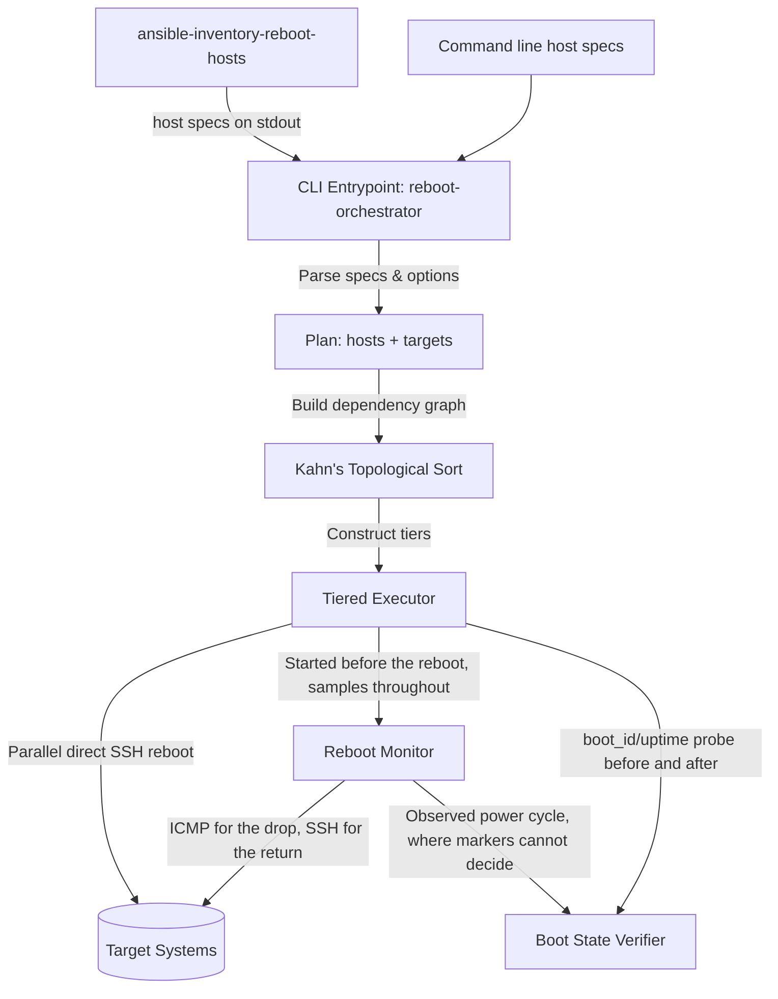

# Design Doc: Reboot Orchestrator

## Status

Approved

## Context

Managing reboots across a complex network with virtual machines, hypervisors,
switches, and firewalls requires sequence awareness. Rebooting a hypervisor
before gracefully shutting down or migrating its child virtual machines, or
rebooting a core gateway before dependent systems are ready, causes network
instability and state failure.

To address this, `reboot-orchestrator` is a lightweight, modular,
dependency-aware Go CLI tool designed to safely orchestrate host reboots across
network infrastructure.

## Goals

- **Caller-Supplied Topology**: Take hosts, their addresses, their SSH user, and
  their ordering directly from the command line or standard input. No inventory
  format is compiled into the tool, and no configuration management runner is
  involved in deciding what to reboot.
- **Topological Sequence (DAG)**: Dynamically group hosts into sequential
  execution tiers based on topological dependency sorting (Kahn's Algorithm).
- **Distinguish the Kinds of Dependency**: Let a topology say whether one host
  merely follows another, is restarted by it, must never go down beside it, or
  must be serving rather than merely reachable before the next tier starts —
  because those four claims imply different behaviour and were previously
  written identically.
- **Credit Carried Reboots**: Where a host is declared to run on another, prove
  whether the parent's reboot restarted it and skip the redundant second reboot
  when it did.
- **Direct, Zero-Dependency Execution**: Perform all state changes directly
  using native, parallelized SSH subprocess calls instead of calling external
  Ansible playbooks or runner engines.
- **Observed Power Cycles**: Watch every host in a tier from before it is
  powered down until it is usable again, so the drop and the return are seen and
  logged rather than inferred from a fixed wait.
- **Proof of Reboot**: Compare each host's kernel boot identity before and after
  the reboot so that a host which never restarted is reported rather than
  silently counted as successful.
- **Pending-Reboot Detection**: Optionally determine over SSH which of the named
  hosts are actually waiting on a reboot, and reboot only those — re-evaluating
  as tiers advance, since rebooting a parent power-cycles its nested guests.
- **Composable Inventory Support**: Keep Ansible inventory parsing available to
  those who want it, in a separate command whose output pipes into the
  orchestrator.

## Proposed Architecture



### 1. Host Specs as the Input Contract

A host spec is a host name followed by optional comma-separated `key=value`
fields, given as a command line argument or a line on standard input:

| Field      | Meaning                                                           |
| ---------- | ----------------------------------------------------------------- |
| `addr`     | Address to ping and SSH to; defaults to the host name             |
| `user`     | SSH login user; defaults to the `--user` flag                     |
| `ssh-arg`  | Extra `ssh` argument; repeatable                                  |
| `after`    | Host that must be back online first; repeatable                   |
| `runs-on`  | Host this one is hosted by, whose reboot restarts it; at most one |
| `not-with` | Host this one must never share a tier with; repeatable            |
| `ready`    | Command proving this host is back; defaults to `true`             |

The last four are the relationship model, set out in section 2.

Specs are parsed as CSV records, so a value containing the delimiter is written
as a quoted field (`web1,"ssh-arg=-oCiphers=aes128-ctr,aes256-ctr"`) rather than
through an escape syntax invented for this tool. The same reader gives blank
lines and `#` comments their conventional meaning in a hand-written host file.

**Targets versus context.** Hosts arriving on stdin describe the topology; hosts
named as arguments are the ones rebooted. A named host that stdin already
defined overlays onto that definition field by field rather than replacing it,
so naming a host to target it costs nothing more than its name, while any single
field can still be overridden at the point of use. `--all` targets every host
read from stdin instead.

This split is what lets a large piped-in topology drive a narrow run: context
hosts are never rebooted, but they can be depended on and are waited for when a
host they sit behind goes down.

### 2. Four Relationships, Not One Dependency

`after` used to be the only edge, and its own doc comment admitted what that
cost: "runs on that box" and "needs that gateway back first" were written
identically, so every consumer had to assume the weakest reading of both. What
people call a dependency is at least four distinct claims, and they imply
different behaviour.

| Field      | Claim                                    | Ordering             | Other consequences                                          |
| ---------- | ---------------------------------------- | -------------------- | ----------------------------------------------------------- |
| `after`    | do not reboot me until that host is back | the named host first | none                                                        |
| `runs-on`  | rebooting that host restarts me          | the named host first | carried-reboot credit, expected drop, contradiction warning |
| `not-with` | never reboot me beside that host         | none — either order  | separate tiers                                              |
| `ready`    | this is what "back" means for me         | none                 | gates every tier waiting on this host                       |

**`after` is ordering and nothing else.** It never claims the named host's
reboot affects this one, which is why nothing is concluded from a dependent that
stays up. Its direction is the operator's to choose, and the two service-
dependency cases order opposite ways: a host that cannot _boot_ without its
provider must follow it, because booting without it leaves a permanently broken
machine; a host that merely _degrades_ while the provider is away should reboot
first, so that it boots into a working world and the provider's outage lands
when nothing is booting. The difference is whether the failure is permanent or
transient, which the tool cannot see, so it does not guess — it accepts either
direction and applies it.

**`runs-on` is the one causal claim**, and the only relationship whose
consequences cannot be expressed as an ordering:

1. The carried reboot is credited rather than repeated (section 7).
2. The guest's drop is expected rather than merely possible (section 6).
3. A guest that stayed up while its parent went down contradicts the
   declaration, and is reported (section 6).
4. Hosting is transitive and single-valued: a container on a guest on a
   hypervisor is carried by one reboot, and a host runs on at most one other,
   because it is in one place at a time.

Nothing is taken on the declaration alone. It decides which hosts are worth
asking; each host then answers for itself from its own boot markers, so a
hypervisor that quietly migrated a guest away cannot cause that guest's reboot
to be skipped.

**`not-with` is neither an ordering nor a cause.** It forbids simultaneity in
either direction, which an ordering cannot express without inventing a sequence
the operator did not mean and asserting a causation that is not there. It is
symmetric: declared on either host it binds both, because it is a fact about the
pair, and requiring it twice would only create the chance to write it once.

**`ready` says what the orderings are actually waiting for.** "Back" defaulted
to a completed SSH login, which is far more than answering ping but well short
of serving: a DNS box accepts logins long before `named` answers queries, and
the tier behind it is waiting for the second moment. It is declared on the
provider, where the fact lives, and gates everyone ordered after it.

**Why separate flat fields rather than a typed edge.** `dep=runs-on:hv1` would
reintroduce exactly the `HOST:COMMAND` sub-grammar that `force-off` was removed
for (decision 4). Flat `key=value` fields keep specs parseable as plain CSV
records, keep each fact written where it is known, and let a fleet ignore every
field it does not need — a topology using only `after` behaves exactly as it did
before these existed.

### 3. Inventory Parsing as a Separate Command

`ansible-inventory-reboot-hosts` converts an Ansible YAML inventory into host
specs on stdout, reading `ip_addr`/`ansible_host`, `ansible_user`,
`ansible_ssh_common_args`, `depends_on`, `runs_on`, `not_with` and `ready`.
Groups nest through `children`, and a host in several groups accumulates
variables from all of them.

The two ends describe the same fact from opposite directions, and the converter
is the hinge. An inventory states what is true of the host a line is written on:
`depends_on` names what that host consumes. The orchestrator wants the only
thing it can act on, an order. So each dependency is inverted here — a host is
rebooted _before_ the hosts it depends on, and the `after` field lands on the
provider rather than on the consumer that declared it.

Inverted, rather than taken at face value, because a consumer rebooted after its
provider comes up into the outage that provider's own restart just opened,
booting without the DNS, storage or gateway it was waiting on. Rebooting it
while the service is still there, and the provider once nothing is mid-boot
behind it, puts the gap where nothing is starting up. A host that genuinely
cannot boot without the service is the other claim, and `runs_on` is how it is
made. Deriving the order rather than writing it also keeps the inventory
readable in the one case where the two diverge most: a provider deliberately
rebooted last would otherwise have to enumerate every client that consumes it.

The two commands are joined by a pipe:

```shell
ansible-inventory-reboot-hosts -i inventory.yml | reboot-orchestrator vm-a vm-b
```

Splitting the tool this way means the orchestrator has no opinion about where
topology comes from, and the inventory reader has no opinion about what is done
with it. A fleet with no inventory is described directly on the command line; a
different inventory format needs a new converter, not a change to the
orchestrator. The interchange is a stream of host specs that a person can read,
diff, or write by hand, which also makes the boundary trivially testable from
both sides.

### 4. Kahn's Topological Sorting

Target hosts are constructed into a Directed Acyclic Graph (DAG) from their
ordering constraints — `after`, plus the ordering `runs-on` implies, folded
together so declaring both is redundant rather than an error:

- Constraints that name hosts outside the target set are ignored, to allow
  narrow/partial execution.
- If a cyclic dependency is declared, the plan is rejected before the
  confirmation prompt rather than after the first tier has already rebooted.
- Kahn's algorithm groups the hosts into distinct execution tiers, sorted such
  that all predecessors of hosts in tier `N` are guaranteed to be in tiers `1`
  through `N-1`.

**Exclusions thin each tier rather than reordering anything.** At every round,
the ready set is taken in name order and a host is held back if it excludes one
already admitted. A held-back host has no constraint of its own left to satisfy;
it is simply still ready next round, which is where it lands.

This is done inside Kahn's loop rather than by splitting finished tiers
afterwards, and that placement is what keeps the result correct. A host is
released only once every predecessor is done, so delaying one automatically
delays everything behind it — where a post-hoc split of tier `N` would leave the
hosts already assigned to `N+1` running before a predecessor that had just been
pushed into it. Progress is guaranteed because the first host of a non-empty
ready set is always admitted; a host that excludes itself is rejected during
validation.

Contradictions between relationships are also caught while the plan is built: a
hosting chain that closes on itself, and an exclusion between a host and one it
is hosted by, which describes a fleet that cannot exist rather than a constraint
a run could honour.

### 5. Direct SSH Execution Model

Reboots are triggered directly using the system `ssh` binary, which keeps the
operator's own `ssh_config`, `known_hosts`, agent, and any `ProxyCommand` in
force — the same root of trust the other tools in this repository rely on, and
the reason `ssh-arg` values are literal `ssh` arguments.

- **SSH Target Formulation**: Connections are formatted as `[user]@[addr]` from
  the host's own fields, falling back to the fleet-wide `--user`.
- **Parallel Reboots**: Reboots in each tier are dispatched concurrently in the
  background running `sudo reboot || reboot`, to prevent connection drops from
  blocking the orchestrator.

### 6. Reboot Monitoring

Sampling starts before anything is powered down and continues on its own
schedule while the tier reboots, so the transition is observed as it happens.
Starting first is what makes the drop evidence at all: a fast guest can be gone
and back inside a single fixed wait.

- **Two probes, two purposes.** ICMP catches the drop, because it is cheap
  enough to sample every second and a powered-off host answers nothing. The
  return is confirmed over SSH, because the kernel answers ping as soon as its
  network stack is up — often well before sshd accepts a connection — and a host
  handed to the next tier on ping alone may not yet be usable.
- **Scope, in three groups.** Every host in the tier is watched, along with
  everything hosted by one of them — transitively, so a container inside a guest
  inside a hypervisor is watched when the hypervisor reboots — and everything
  merely ordered after one of them. All three are sampled identically and differ
  only in what a host answering throughout is worth. A **target** was told to
  reboot, so never leaving the network is evidence it did not. A **carried**
  host was claimed to be restarted by its parent, so answering every probe while
  that parent went down contradicts the claim — and the claim is the likelier
  thing to be wrong, since a guest migrated to another hypervisor looks exactly
  like this. A **dependent** was told nothing and promised nothing; it is
  watched only in case it goes down, and says nothing at all by staying up. A
  host qualifying under more than one group is watched as the strongest.
- **What counts as back.** The SSH probe runs the host's `ready` command, or
  `true` when it declared none. The default tests that a login completed, which
  is all that can be assumed of a host the tool knows nothing else about; a host
  others depend on for a service says what serving means, because everything
  ordered after it is waiting for that moment and not for `sshd`. The first
  failure of a declared readiness command is reported with its own error, once:
  a command that will never pass and a service still starting are otherwise both
  just silence.
- **Sample timing.** A sweep is stamped with the instant it began rather than
  each probe reading the clock as it finishes, so a tier that went down together
  is recorded as having gone down together.
- **The drop wait.** `--drop-wait` is how long the monitor keeps watching for a
  host to stop answering. It bounds the waiting only: a drop is recorded
  whenever it is seen, early or late. What running out settles is the other
  direction, where there is nothing to see — a host that answered every probe
  for the whole drop wait is taken to have stayed up, and the run stops waiting
  for a drop that is not coming. One drop wait covers the tier, not one per
  host, and it replaces the fixed delay every tier used to pay.
- **When the drop wait starts.** Sampling starts before anything goes down, but
  the drop wait does not start with it: it starts once the tier's commands are
  away. A drop wait started at the first sample would run out while the run was
  still issuing the very commands it is timing, reporting hosts as never having
  left a network they had not yet been asked to leave — and letting a tier count
  as settled before a single host had gone anywhere.
- **Hosts that never drop.** A _targeted_ host still answering after the drop
  wait is reported once and the run proceeds. The monitor states only what it
  saw; whether that means a failed reboot is decided by verification, weighing
  it against the host's own boot markers. A _carried_ host is reported too, but
  as a different finding and only once its parent has actually gone down: the
  line is about the topology, not the machine, and a hypervisor that ignored its
  own reboot explains a still-answering guest completely while already having a
  line of its own. _Dependents_ are left out entirely: nothing was asked of
  them, and their `after` edge never promised they would go down, so remarking
  on one that did not flagged the ordinary case and buried the lines that mean
  something.

### 7. Boot State Verification

Reachability alone is a necessary but insufficient signal, so each tier is also
bracketed by a boot identity probe read from the host itself.

- **Markers**: `/proc/sys/kernel/random/boot_id` is authoritative because the
  kernel regenerates it on every boot. `/proc/uptime` is the fallback for hosts
  that expose no boot ID (busybox-based firmware, network appliances). Both are
  read in a single POSIX-shell command over SSH.
- **Baseline timing**: The pre-reboot probe runs at the top of the tier, before
  any host is told to reboot, so the reboot cannot race the probe.
- **Comparison**: A changed boot ID confirms the reboot. Without a boot ID, an
  uptime that dropped below its previous value, or below the elapsed wall-clock
  window between the two readings, confirms it. An unchanged boot ID or an
  uptime that kept accumulating proves the host stayed up.
- **Observation breaks ties**: Markers stay authoritative, being read from the
  host rather than seen from outside. Where they cannot settle the question, the
  observed cycle does: a host seen to go down and come back is confirmed, and
  one that answered every probe for the whole drop wait is reported as never
  having rebooted. This is what makes appliances and switches — which expose
  neither marker — verifiable at all.
- **Carried reboots**: A host declared to run on a member of the tier, and
  targeted by a later tier, is bracketed by the same two readings — the first
  taken before its parent goes down, since afterwards the evidence has already
  been overwritten by the boot it came back on. One that provably restarted is
  reported as confirmed, attributed to its parent, and dropped from the tier
  that meant to reboot it; one that cannot be shown to have restarted is left
  alone rather than counted as a failure, because nothing was asked of it. It
  keeps its place in a later tier and is rebooted there, which is exactly what
  would have happened had the hosting never been declared.

  Crediting is deliberately evidence-driven rather than declaration-driven: a
  reboot is skipped because it demonstrably already happened, never because the
  topology said it should have. So it does not happen under
  `--skip-boot-verification`, and a hypervisor that quietly migrated a guest
  away cannot cause that guest's reboot to be skipped. Only hosts a later tier
  actually targets are read, because a baseline costs a connection per host and
  a hypervisor's guests are where a fleet keeps its largest counts; the rest are
  watched all the same, but nothing is asked of them.

- **Unverifiable hosts**: A host that neither exposes a marker nor was observed
  either way is reported as unverified rather than assumed successful.
- **Failure handling**: Orchestration continues through the remaining tiers so a
  run is never left half-applied, and closes with a summary grouping hosts by
  outcome. The CLI exits non-zero when a host is proven not to have rebooted.

### 8. Command Transparency

Every SSH and ping invocation is echoed as a quoted, copy-pasteable shell line
before it executes. Because the tool mutates infrastructure state through
fire-and-forget subprocesses, an operator watching the run can see exactly what
was attempted against which host and reproduce any step by hand.

Every line about a particular host leads with that host's name —
`vm-a: [down] stopped answering at 09:14:07`, `vm-a: $ ssh … 10.0.0.21 …` — so
the transcript is read down a single column of names. This is what makes the
echoed commands usable: a command carries an address, because an address is what
`ssh` and `ping` take, and nothing else on the line says whose address it is.
Lines about the run rather than a host — tier headers, the watch list, the
closing summary — carry no prefix, which is what makes the prefix mean
something.

Indentation still carries the hierarchy, one level for a line belonging to the
action announced above it: the commands echoed under
`Issuing reboot command to`, the verdicts under `Verifying boot state changed`.
The monitor's observations are the exception and sit at the left margin, because
they arrive on the sampler's own schedule rather than under any announced step —
which is also where a reader scanning a long run for what actually happened
wants them, set apart from what was merely attempted.

### 9. Pending-Reboot Detection (`--if-needed`)

Rather than depend on a configuration management runner to decide which hosts to
hand over, the orchestrator can determine that itself. The check is a single
unprivileged shell script piped to `/bin/sh` on the remote's standard input —
piped rather than passed as an argument so it is unaffected by the login shell,
which on FreeBSD is commonly csh, and so shell quoting never enters into it. It
branches on `uname -s`: FreeBSD compares the running kernel (`uname -r`) against
the installed one (`freebsd-version -k`); elsewhere it tests for apt's
`/var/run/reboot-required` flag and reads the adjacent `.pkgs` file for detail.

Detection deliberately re-runs per tier rather than once up front. A parent's
reboot power-cycles every guest nested under it, so a guest's initial verdict is
stale by the time its tier is reached; acting on it would reboot that guest a
second time for an update the parent's reboot already applied. Each tier after
the first is therefore re-probed immediately before executing, hosts that now
report clean are dropped, and a tier emptied that way is skipped without a
reboot or a ping wait. Re-probing is safe at that moment because the preceding
tier already waited for its hosts _and their dependents_ to answer ping again.

A host that cannot be probed resolves to a third state, distinct from "up to
date": it is excluded from the reboot set and reported, and the process exits
non-zero so a calling script cannot mistake an unchecked host for a healthy one.

The carried-reboot credit of section 7 and this re-check answer different
questions and compose in that order. The credit asks whether a host already
restarted, and is definitive: a machine that rebooted three minutes ago does not
need rebooting again, whatever it reports. The re-check asks whether a host has
anything queued that a reboot would apply. A host the credit dropped is
therefore never re-probed, which also spares the connection.

The per-tier re-check runs ahead of the boot state baseline described in section
7, and the two compose deliberately: a host dropped by the re-check is never
rebooted, so it is neither probed for a baseline it would not change nor listed
in the verification summary as a host that failed to reboot. Verification covers
exactly the hosts the orchestrator actually acted on.

---

## Key Design Decisions & Rationale

### 1. Go as the Implementation Language

The tool was originally written in Python and rewritten in Go:

- **Single Static Binary**: Reboot orchestration is run against infrastructure,
  often from a jump host or a CI runner. A static binary with no interpreter and
  no virtual environment to provision removes a dependency on the very fleet
  being rebooted.
- **Consistency With the Repository**: Every other tool here is Go, sharing the
  `service-management` module, its lint and test configuration, and its
  established pattern of shelling out to the system `ssh` binary.
- **Concurrency and Subprocess Control**: Goroutines with a bounded worker limit
  express the parallel probe and reboot dispatch directly, and `context`
  deadlines give every SSH invocation a timeout and make a long ping wait
  interruptible.

### 2. Topology on the Command Line, Not in an Inventory

The tool previously read an Ansible `inventory.yml` directly, which coupled it
to Ansible's file format for what is really a small amount of per-host data:
where to connect, as whom, and what must precede what.

Taking that data as arguments or on standard input means the orchestrator can
reboot hosts that appear in no inventory at all, and that a site using some
other source of truth writes a converter rather than a patch. Inventory support
did not disappear — it moved into `ansible-inventory-reboot-hosts`, where it is
one translation step that can be inspected, tested, and replaced independently.

### 3. Boot Identity Over Command Exit Status

An obvious alternative is to check the exit status of the reboot command itself.
This is unreliable: `reboot` severs the SSH connection as a matter of course, so
a non-zero status is expected on success, and the command is dispatched
asynchronously precisely so that connection drops do not hang the orchestrator.
Reading the boot identity from the host after it returns measures the outcome
that actually matters — whether the kernel restarted — rather than whether a
command was accepted.

### 4. No Handling for Hosts That Hang on Power Off

The tool once carried a `force-off` field: a host that never completed its
power-down sequence could name a delegate and a command
(`force-off=hv1:qm stop 101`), and the orchestrator would halt it gracefully,
wait out a grace period, and then run that command on the delegate to cut its
power.

It was removed as more machinery than the problem justified. One optional field
reached into every layer of the tool — the spec format and its `HOST:COMMAND`
sub-grammar, the inventory converter, host validation, a flag of its own, and a
power-down step interleaved with tier execution that had to be reasoned about
against monitoring, baseline capture, and hosts qualifying twice — to serve a
minority of hosts in a way an operator can already handle directly, by stopping
the guest from its hypervisor before starting the run.

The cost of the removal is that a guest which hangs instead of powering off
still stalls the shutdown of the machine underneath it. That is now the
operator's to deal with, and the tool stays a tool that reboots hosts in order
and proves they restarted.

### 5. Named Relationship Fields Over One Overloaded Edge

Adding a field reaches into every layer of this tool — the spec format, the
inventory converter, host validation, tier construction, the monitor, the
verifier, and the docs — which is exactly the cost that got `force-off` removed
above. The bar each of these had to clear was therefore whether it changes
behaviour or only vocabulary.

`runs-on` clears it comfortably: the carried-reboot credit cannot be expressed
as an ordering, and without it a fleet pays a second outage per guest on every
hypervisor reboot. `not-with` clears it because simultaneity is not an ordering
at all, and faking it with `after` invents a sequence and asserts a causation
neither of which is true. `ready` clears it because "back" was answering a
question — has `sshd` started — that no dependent was actually asking.

What was deliberately not added is a general typed-edge grammar
(`dep=runs-on:hv1`), which is the `HOST:COMMAND` sub-grammar of `force-off`
wearing a different hat, and a `before` field, which is real but pure sugar: the
graph does not care which end of an edge declares it, so an operator who wants a
provider rebooted last writes the ordering on the provider. That may still be
worth adding for the sake of writing each fact where it is known; it is not
worth adding for anything it would let a run do.

Nothing here is required. A topology using only `after` builds the same tiers,
watches the same hosts, and reaches the same verdicts as it did before any of
these existed.

---

## Known Limitations

- **A host that hangs on power off stalls its parent.** Nothing here cuts the
  power of a guest that halts and never finishes shutting down, so the
  hypervisor beneath it waits out its own shutdown timeout.
- **`ping -W` assumes iputils semantics**, where the flag is a timeout in whole
  seconds. On BSD and macOS the same flag means milliseconds, so a run driven
  from those platforms polls faster than configured.
- **A readiness command that never passes waits forever.** There is no readiness
  timeout: a host that dropped and came back on ping but never satisfies its
  `ready` command is waited on until the operator interrupts the run. This is
  the pre-existing behaviour for a host that never returns at all, but `ready`
  makes it easier to reach by mistyping a check. The first failure is reported
  with the command's own error so the cause is visible rather than silent.
- **An exclusion cannot survive a carried reboot.** `not-with` governs the
  reboots this tool issues, so two guests of one hypervisor may exclude each
  other and will be rebooted in separate tiers — but rebooting the hypervisor
  itself takes both at once, and nothing here prevents that. It is a property of
  where the two hosts live rather than something the run can order around, and
  the fix is to move one of them.
- **Nothing models the path to a host.** Where the orchestrator reaches a host
  _through_ another — a switch, a firewall, a jump host — that host's reboot
  makes the ones behind it unreachable while they are perfectly healthy. Since
  the observed power cycle is what settles verification for hosts exposing no
  boot marker, and switches and appliances are exactly those hosts, a path
  outage during the window in which such a host was targeted could read as a
  confirmed reboot. This is narrow, requiring the host to have been targeted and
  SSH-reachable at both ends, but it is the one relationship whose absence can
  produce a wrong verdict rather than merely a redundant reboot.

---

## Testing Strategy

Since the orchestrator is responsible for critical infrastructure state changes,
the test suite is designed with high testability and side-effect isolation:

1. **Logical Unit Tests**: Kahn's topological tier sequencing, exclusion
   thinning, cycle detection, relationship validation, spec parsing, and
   inventory flattening run entirely in memory against constructed topologies,
   with no file or network access.
2. **Side-Effect Isolation**: Every external effect goes through one of two
   interfaces — `Runner` for command execution and `Clock` for the passage of
   time — so tests substitute fakes for all SSH, ping, and waiting. The fake
   clock also makes the real waiting logic assertable: a test can check that a
   tier waited exactly the configured drop wait plus one poll interval per
   failed sweep, without any test taking that long.
3. **Fleet Simulation**: End-to-end orchestration tests model hosts whose boot
   identity changes when they are rebooted, and hypervisors that change their
   guests' identities alongside their own. That is what allows the verification
   path to be exercised deterministically — a host that accepts the command and
   stays up, a guest whose free reboot is credited, and a guest declared to run
   somewhere it no longer does, which must still be rebooted in its own tier.
4. **Round-Trip Coverage**: The host spec format is tested from both sides, so
   what `ansible-inventory-reboot-hosts` emits is proven to parse back into the
   same hosts the orchestrator would act on.
