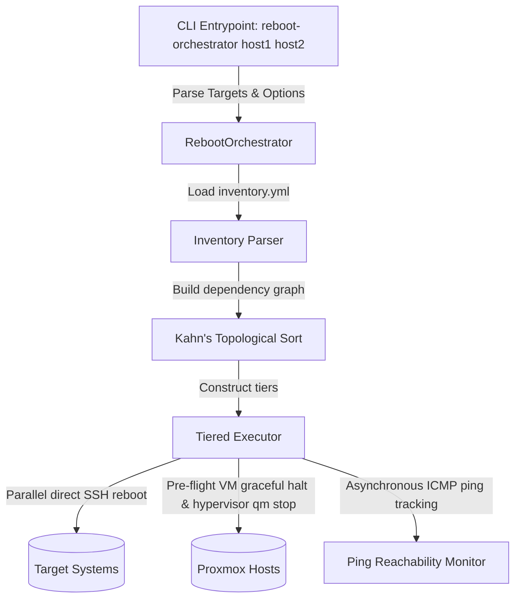

# Design Doc: Reboot Orchestrator

## Status

Approved

## Context

Managing reboots across a complex network with virtual machines, hypervisors,
switches, and firewalls requires sequence awareness. Rebooting a hypervisor
before gracefully shutting down or migrating its child virtual machines, or
rebooting a core gateway before dependent systems are ready, causes network
instability and state failure.

To address this, `reboot-orchestrator` is a lightweight, modular, and
dependency-aware Python library and CLI tool designed to safely orchestrate host
reboots across network infrastructure.

## Goals

- **Inventory-Driven Dependency Parsing**: Consume standard Ansible YAML
  inventories to retrieve network topology, dependency layers, and hypervisor
  configurations.
- **Topological Sequence (DAG)**: Dynamically group hosts into sequential
  execution tiers based on topological dependency sorting (Kahn's Algorithm).
- **Direct, Zero-Dependency Execution**: Perform all state changes (graceful
  halts, power cuts, and system reboots) directly using native, parallelized SSH
  subprocess calls instead of calling external Ansible playbooks or runner
  engines.
- **Reachability and State Verification**: Track system online/offline
  transitions asynchronously using continuous ICMP ping loops to guarantee a
  tier is fully online before moving to the next.
- **ACPI "Zombie" VM Workaround**: Safely handle virtual machines suffering from
  poweroff/ACPI bugs by executing pre-flight graceful halts and issuing fallback
  VM cut-power commands on the hypervisor host.

## Proposed Architecture

### 1. Inventory & Dependency Parsing

The orchestrator treats the standard Ansible `inventory.yml` file as the source
of truth for host configuration. It loads and flattens the inventory into a
simplified mapping of hostnames to attributes, parsing the following custom
parameters:

- `ip_addr` or `ansible_host`: Connection target IP address or hostname.
- `ansible_user`: SSH connection user (optional).
- `ansible_ssh_common_args`: Custom SSH arguments (e.g. ignoring host keys,
  optional).
- `depends_on`: A list of parent hostnames that must be fully online before the
  host is rebooted.
- `proxmox_zombie_workaround`: Configuration dictionary containing `delegate_to`
  (hypervisor hostname) and `vmid` (Proxmox VM ID).

### 2. Kahn's Topological Sorting

Target hosts passed via command line are constructed into a Directed Acyclic
Graph (DAG) using their `depends_on` relationships:

- Dependencies that are not in the targeted list are ignored to allow
  narrow/partial execution.
- If a cyclic dependency is declared, the validator raises an error to prevent
  infinite hangs.
- Kahn's algorithm groups the hosts into distinct execution tiers, sorted such
  that all dependencies of hosts in tier `N` are guaranteed to be in tiers `1`
  through `N-1`.

### 3. Direct SSH Execution Model

Reboots and workarounds are triggered directly using standard `ssh` commands:

- **SSH Target Formulation**: Connections are formatted as `[user]@[ip]` using
  parsed inventory properties.
- **Parallel Reboots**: Reboots in each tier are dispatched concurrently in the
  background using `subprocess.Popen` running `sudo reboot || reboot` to prevent
  connection drops from blocking the orchestrator.
- **Graceful Workarounds**: For hosts with ACPI shutdown bugs, the orchestrator
  issues `sudo poweroff || poweroff` via SSH, waits a configurable number of
  seconds, and then enforces a fallback `sudo qm stop || qm stop` via SSH on the
  delegate hypervisor.

### 4. ICMP Reachability Monitoring

- During execution, the orchestrator tracks host transitions from online to
  offline, and back to online.
- High-performance, asynchronous ping loops verify that all hosts in the current
  tier are fully reachable and online before the orchestrator progresses to the
  next tier.

---

## Key Design Decisions & Rationale

### 1. Python as the Implementation Language

Python was selected as the implementation language for several reasons:

- **YAML & JSON Synergy**: Python natively handles YAML parsing (`PyYAML`) and
  dynamic JSON outputs without requiring heavy compiled structures. It fits
  cleanly into standard repository virtual environments.
- **Dictionary-Based Graph Manipulation**: Building the reboot Directed Acyclic
  Graph (DAG) and calculating Khan's topological sort is concise and highly
  readable using Python's set and dictionary comprehensions.
- **Concurrency & Subprocess Overhead**: Standard libraries like `time`,
  `shlex`, and `subprocess` allow parallel non-blocking command execution via
  `subprocess.Popen` and easy reachability checks without external third-party
  execution wrappers.

### 2. Generic VM ACPI Zombie Intervention

While virtual guest management utilities (such as QEMU guest agents) gracefully
shut down VMs via standard ACPI power off signals, certain virtualized guest
operating systems successfully halt all filesystem software but fail to complete
the hardware motherboard power-down sequence. This leaves the guest in a
"zombie" state, hanging hypervisor reboot timeouts.

- The orchestrator handles this in a completely generic fashion. Rather than
  hardcoding VM targets, it checks the inventory for the
  `proxmox_zombie_workaround` API contract.
- Before a VM (or its host hypervisor) is rebooted, the orchestrator issues a
  graceful `poweroff` via SSH, waits a configured duration, and then issues a
  forced power-cut command (`qm stop <vmid>`) to the hypervisor host via SSH to
  guarantee the virtual machine is fully shut down.

---

## Testing Strategy

Since the orchestrator is responsible for critical infrastructure state changes,
the test suite is designed with high testability and side-effect isolation:

1. **Logical Unit Tests**: Kahn's topological DAG sequencing, cyclic dependency
   parsing, and inventory flattening accept mock dictionary topologies, allowing
   tests to run entirely in-memory without accessing actual system
   configurations or file handles.
2. **Side-Effect Mocking**: All network reachability checks (`ping`), sleep
   timers (`time.sleep`), and external terminal commands (`subprocess.Popen`,
   `subprocess.run`) are mocked using `unittest.mock.patch`. This enables
   simulating various infrastructure scenarios (such as dynamic connection
   failures, network drops, and slow hypervisor shutdowns) deterministically.
3. **Modular Test Structures**: A 1-to-1 mapping is maintained between package
   source code files and unit test scripts, making code/test connections direct
   and straightforward to trace.
