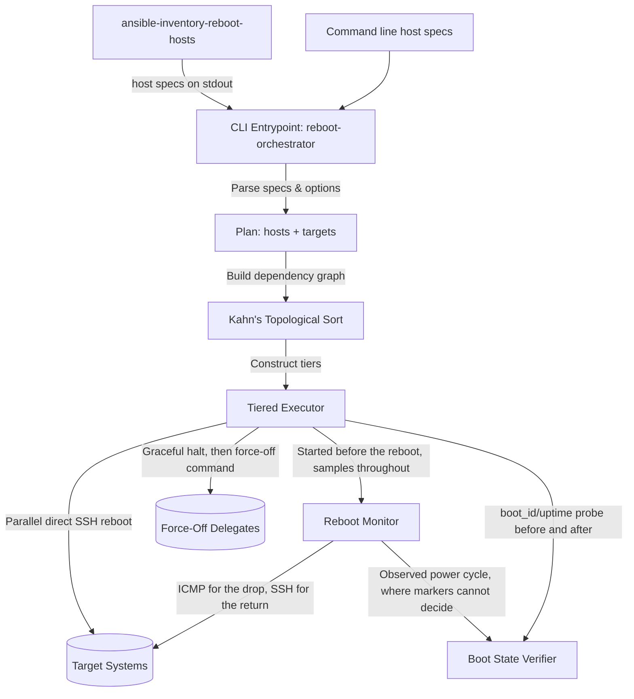

# Design Doc: Reboot Orchestrator

## Status

Approved

## Context

Managing reboots across a complex network with virtual machines, hypervisors,
switches, and firewalls requires sequence awareness. Rebooting a hypervisor
before gracefully shutting down or migrating its child virtual machines, or
rebooting a core gateway before dependent systems are ready, causes network
instability and state failure.

To address this, `reboot-orchestrator` is a lightweight, modular,
dependency-aware Go CLI tool designed to safely orchestrate host reboots across
network infrastructure.

## Goals

- **Caller-Supplied Topology**: Take hosts, their addresses, their SSH user, and
  their ordering directly from the command line or standard input. No inventory
  format is compiled into the tool, and no configuration management runner is
  involved in deciding what to reboot.
- **Topological Sequence (DAG)**: Dynamically group hosts into sequential
  execution tiers based on topological dependency sorting (Kahn's Algorithm).
- **Direct, Zero-Dependency Execution**: Perform all state changes directly
  using native, parallelized SSH subprocess calls instead of calling external
  Ansible playbooks or runner engines.
- **Force-Off for Hosts That Hang**: Safely handle machines that fail to
  complete an ACPI power off by halting them gracefully and then cutting their
  power from elsewhere, without building any particular hypervisor into the
  tool.
- **Observed Power Cycles**: Watch every host in a tier from before it is
  powered down until it is usable again, so the drop and the return are seen and
  logged rather than inferred from a fixed wait.
- **Proof of Reboot**: Compare each host's kernel boot identity before and after
  the reboot so that a host which never restarted is reported rather than
  silently counted as successful.
- **Pending-Reboot Detection**: Optionally determine over SSH which of the named
  hosts are actually waiting on a reboot, and reboot only those — re-evaluating
  as tiers advance, since rebooting a parent power-cycles its nested guests.
- **Composable Inventory Support**: Keep Ansible inventory parsing available to
  those who want it, in a separate command whose output pipes into the
  orchestrator.

## Proposed Architecture



### 1. Host Specs as the Input Contract

A host spec is a host name followed by optional comma-separated `key=value`
fields, given as a command line argument or a line on standard input:

| Field       | Meaning                                               |
| ----------- | ----------------------------------------------------- |
| `addr`      | Address to ping and SSH to; defaults to the host name |
| `user`      | SSH login user; defaults to the `--user` flag         |
| `ssh-arg`   | Extra `ssh` argument; repeatable                      |
| `after`     | Host that must be back online first; repeatable       |
| `force-off` | `HOST:COMMAND` to cut this host's power if it hangs   |

Specs are parsed as CSV records, so a value containing the delimiter is written
as a quoted field (`web1,"ssh-arg=-oCiphers=aes128-ctr,aes256-ctr"`) rather than
through an escape syntax invented for this tool. The same reader gives blank
lines and `#` comments their conventional meaning in a hand-written host file.

**Targets versus context.** Hosts arriving on stdin describe the topology; hosts
named as arguments are the ones rebooted. A named host that stdin already
defined overlays onto that definition field by field rather than replacing it,
so naming a host to target it costs nothing more than its name, while any single
field can still be overridden at the point of use. `--all` targets every host
read from stdin instead.

This split is what lets a large piped-in topology drive a narrow run: context
hosts are never rebooted, but they can be depended on and are waited for when a
host they sit behind goes down.

### 2. Inventory Parsing as a Separate Command

`ansible-inventory-reboot-hosts` converts an Ansible YAML inventory into host
specs on stdout, reading `ip_addr`/`ansible_host`, `ansible_user`,
`ansible_ssh_common_args`, `depends_on`, and `force_off`. Groups nest through
`children`, and a host in several groups accumulates variables from all of them.

The two commands are joined by a pipe:

```shell
ansible-inventory-reboot-hosts -i inventory.yml | reboot-orchestrator vm-a vm-b
```

Splitting the tool this way means the orchestrator has no opinion about where
topology comes from, and the inventory reader has no opinion about what is done
with it. A fleet with no inventory is described directly on the command line; a
different inventory format needs a new converter, not a change to the
orchestrator. The interchange is a stream of host specs that a person can read,
diff, or write by hand, which also makes the boundary trivially testable from
both sides.

### 3. Kahn's Topological Sorting

Target hosts are constructed into a Directed Acyclic Graph (DAG) using their
`after` relationships:

- Constraints that name hosts outside the target set are ignored, to allow
  narrow/partial execution.
- If a cyclic dependency is declared, the plan is rejected before the
  confirmation prompt rather than after the first tier has already rebooted.
- Kahn's algorithm groups the hosts into distinct execution tiers, sorted such
  that all predecessors of hosts in tier `N` are guaranteed to be in tiers `1`
  through `N-1`.

### 4. Direct SSH Execution Model

Reboots are triggered directly using the system `ssh` binary, which keeps the
operator's own `ssh_config`, `known_hosts`, agent, and any `ProxyCommand` in
force — the same root of trust the other tools in this repository rely on, and
the reason `ssh-arg` values are literal `ssh` arguments.

- **SSH Target Formulation**: Connections are formatted as `[user]@[addr]` from
  the host's own fields, falling back to the fleet-wide `--user`.
- **Parallel Reboots**: Reboots in each tier are dispatched concurrently in the
  background running `sudo reboot || reboot`, to prevent connection drops from
  blocking the orchestrator.
- **Force-Off**: A host declaring `force-off` is halted gracefully, given
  `--force-off-wait`, and then powered down by running its command on the
  delegate. The command runs verbatim rather than being wrapped in the
  `sudo X || X` pattern used for the tool's own commands: it belongs to the
  operator, and this tool cannot know whether the delegate's CLI wants sudo.

### 5. Reboot Monitoring

Sampling starts before anything is powered down and continues on its own
schedule while the tier reboots, so the transition is observed as it happens.
Starting first is what makes the drop evidence at all: a force-off can take a
guest away before its own reboot is ever issued, and a fast guest can be gone
and back inside a single fixed wait.

- **Two probes, two purposes.** ICMP catches the drop, because it is cheap
  enough to sample every second and a powered-off host answers nothing. The
  return is confirmed over SSH, because the kernel answers ping as soon as its
  network stack is up — often well before sshd accepts a connection — and a host
  handed to the next tier on ping alone may not yet be usable.
- **Scope.** Every host in the tier is watched, along with every host that sits
  behind one of them: a dependent goes down with its parent whether or not it
  was targeted itself.
- **Sample timing.** A sweep is stamped with the instant it began rather than
  each probe reading the clock as it finishes, so a tier that went down together
  is recorded as having gone down together.
- **Hosts that never drop.** A host still answering after its drop window is
  reported once and the run proceeds. The monitor states only what it saw;
  whether that means a failed reboot is decided by verification, which knows
  which hosts were actually targeted.
- **Replaces the fixed wait.** `--wait-drop` bounds how long a host that never
  stops answering is waited for, rather than being a delay every tier pays.

### 6. Boot State Verification

Reachability alone is a necessary but insufficient signal, so each tier is also
bracketed by a boot identity probe read from the host itself.

- **Markers**: `/proc/sys/kernel/random/boot_id` is authoritative because the
  kernel regenerates it on every boot. `/proc/uptime` is the fallback for hosts
  that expose no boot ID (busybox-based firmware, network appliances). Both are
  read in a single POSIX-shell command over SSH.
- **Baseline timing**: The pre-reboot probe runs at the top of the tier, before
  any host is told to reboot or forced off, so neither can race the probe.
- **Comparison**: A changed boot ID confirms the reboot. Without a boot ID, an
  uptime that dropped below its previous value, or below the elapsed wall-clock
  window between the two readings, confirms it. An unchanged boot ID or an
  uptime that kept accumulating proves the host stayed up.
- **Observation breaks ties**: Markers stay authoritative, being read from the
  host rather than seen from outside. Where they cannot settle the question, the
  observed cycle does: a host seen to go down and come back is confirmed, and
  one that answered every probe for its whole drop window is reported as never
  having rebooted. This is what makes appliances and switches — which expose
  neither marker — verifiable at all.
- **Unverifiable hosts**: A host that neither exposes a marker nor was observed
  either way is reported as unverified rather than assumed successful.
- **Failure handling**: Orchestration continues through the remaining tiers so a
  run is never left half-applied, and closes with a summary grouping hosts by
  outcome. The CLI exits non-zero when a host is proven not to have rebooted.

### 7. Command Transparency

Every SSH and ping invocation is echoed as a quoted, copy-pasteable shell line
before it executes. Because the tool mutates infrastructure state through
fire-and-forget subprocesses, an operator watching the run can see exactly what
was attempted against which host and reproduce any step by hand.

### 8. Pending-Reboot Detection (`--if-needed`)

Rather than depend on a configuration management runner to decide which hosts to
hand over, the orchestrator can determine that itself. The check is a single
unprivileged shell script piped to `/bin/sh` on the remote's standard input —
piped rather than passed as an argument so it is unaffected by the login shell,
which on FreeBSD is commonly csh, and so shell quoting never enters into it. It
branches on `uname -s`: FreeBSD compares the running kernel (`uname -r`) against
the installed one (`freebsd-version -k`); elsewhere it tests for apt's
`/var/run/reboot-required` flag and reads the adjacent `.pkgs` file for detail.

Detection deliberately re-runs per tier rather than once up front. A parent's
reboot power-cycles every guest nested under it, so a guest's initial verdict is
stale by the time its tier is reached; acting on it would reboot that guest a
second time for an update the parent's reboot already applied. Each tier after
the first is therefore re-probed immediately before executing, hosts that now
report clean are dropped, and a tier emptied that way is skipped without a
reboot or a ping wait. Re-probing is safe at that moment because the preceding
tier already waited for its hosts _and their dependents_ to answer ping again.

A host that cannot be probed resolves to a third state, distinct from "up to
date": it is excluded from the reboot set and reported, and the process exits
non-zero so a calling script cannot mistake an unchecked host for a healthy one.

The per-tier re-check runs ahead of the boot state baseline described in section
6, and the two compose deliberately: a host dropped by the re-check is never
rebooted, so it is neither probed for a baseline it would not change nor listed
in the verification summary as a host that failed to reboot. Verification covers
exactly the hosts the orchestrator actually acted on.

---

## Key Design Decisions & Rationale

### 1. Go as the Implementation Language

The tool was originally written in Python and rewritten in Go:

- **Single Static Binary**: Reboot orchestration is run against infrastructure,
  often from a jump host or a CI runner. A static binary with no interpreter and
  no virtual environment to provision removes a dependency on the very fleet
  being rebooted.
- **Consistency With the Repository**: Every other tool here is Go, sharing the
  `service-management` module, its lint and test configuration, and its
  established pattern of shelling out to the system `ssh` binary.
- **Concurrency and Subprocess Control**: Goroutines with a bounded worker limit
  express the parallel probe and reboot dispatch directly, and `context`
  deadlines give every SSH invocation a timeout and make a long ping wait
  interruptible.

### 2. Topology on the Command Line, Not in an Inventory

The tool previously read an Ansible `inventory.yml` directly, which coupled it
to Ansible's file format for what is really a small amount of per-host data:
where to connect, as whom, and what must precede what.

Taking that data as arguments or on standard input means the orchestrator can
reboot hosts that appear in no inventory at all, and that a site using some
other source of truth writes a converter rather than a patch. Inventory support
did not disappear — it moved into `ansible-inventory-reboot-hosts`, where it is
one translation step that can be inspected, tested, and replaced independently.

### 3. Boot Identity Over Command Exit Status

An obvious alternative is to check the exit status of the reboot command itself.
This is unreliable: `reboot` severs the SSH connection as a matter of course, so
a non-zero status is expected on success, and the command is dispatched
asynchronously precisely so that connection drops do not hang the orchestrator.
Reading the boot identity from the host after it returns measures the outcome
that actually matters — whether the kernel restarted — rather than whether a
command was accepted.

### 4. A Command and a Delegate, Not a Hypervisor Integration

Handling hosts that hang on power off needs two things: something that can cut
the power, and the way to ask it to. An earlier form of this feature hard-wired
both, taking a Proxmox VM ID and building `qm stop <vmid>` from it. That put a
specific hypervisor's CLI inside a tool that otherwise knows nothing about
virtualisation, and left every other environment — LXC containers on the same
Proxmox host, libvirt, a switched PDU in front of a bare metal machine —
unserved despite having exactly the same problem and an equally simple answer.

Taking the command itself instead makes the feature indifferent to what is
underneath it. `force-off=hv1:qm stop 101` and
`force-off=kvm1:virsh destroy vm-a` are the same feature, and the tool needs no
release to support the next environment. It also collapses two coupled fields
into one that reads as a sentence: force this host off, via `hv1`, by running
`qm stop 101`. The `HOST:COMMAND` shape is borrowed from `scp` and `rsync`,
where a colon has meant "on that host, this thing" for decades.

The cost is that a malformed command is only discovered when it runs. That is
the same trade already made for `ssh-arg` and for the reboot commands
themselves, and the alternative — validating commands this tool does not own —
is not one it can honour.

---

## Known Limitations

- **A force-off command is trusted, not checked.** It is run verbatim on the
  delegate, so a typo fails at the moment the power needed cutting. Its output
  is echoed and its failure warned about, but the run continues, since a host
  that shut down cleanly also makes the command fail.
- **`ping -W` assumes iputils semantics**, where the flag is a timeout in whole
  seconds. On BSD and macOS the same flag means milliseconds, so a run driven
  from those platforms polls faster than configured.

---

## Testing Strategy

Since the orchestrator is responsible for critical infrastructure state changes,
the test suite is designed with high testability and side-effect isolation:

1. **Logical Unit Tests**: Kahn's topological tier sequencing, cycle detection,
   spec parsing, and inventory flattening run entirely in memory against
   constructed topologies, with no file or network access.
2. **Side-Effect Isolation**: Every external effect goes through one of two
   interfaces — `Runner` for command execution and `Clock` for waiting — so
   tests substitute fakes for all SSH, ping, and sleep behaviour. The fake clock
   also makes the real waiting logic assertable: a test can check that a tier
   waited exactly the configured drop delay plus one poll interval per failed
   sweep, without any test taking that long.
3. **Fleet Simulation**: End-to-end orchestration tests model hosts whose boot
   identity changes when they are rebooted, which is what allows the
   verification path — including a host that accepts the command and stays up —
   to be exercised deterministically.
4. **Round-Trip Coverage**: The host spec format is tested from both sides, so
   what `ansible-inventory-reboot-hosts` emits is proven to parse back into the
   same hosts the orchestrator would act on.
